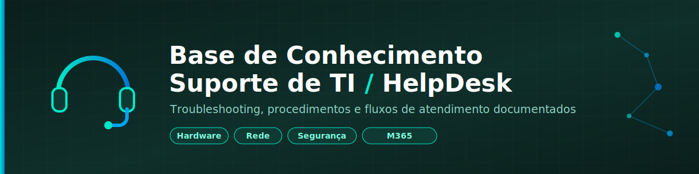

<div align="center">



# 🎧 Base de Conhecimento — Suporte de TI / HelpDesk

**Procedimentos, troubleshooting e fluxos de atendimento documentados para o dia a dia de suporte de TI**

[](https://github.com/4ndreLuiz2807/helpdesk-kb/commits/main)
[](./artigos)
[](./LICENSE)
[](./scripts)

</div>

---

## 📖 Sobre

Este repositório reúne artigos de troubleshooting, procedimentos padrão e fluxos de atendimento usados no suporte de TI. Cada artigo documenta um problema real, o diagnóstico passo a passo, e a solução — no formato mais próximo possível do que alguém no primeiro atendimento precisa para resolver rápido.

Repositório irmão deste: [lab-intune-entraid](https://github.com/4ndreLuiz2807/lab-intune-entraid), focado especificamente em Intune/Entra ID/M365. Aqui entra o suporte de TI mais geral — hardware, rede, impressoras, contas, e os fluxos de atendimento em si.

## 📑 Índice

- [Estrutura](#️-estrutura)
- [Fluxo de atendimento](#-fluxo-de-atendimento)
- [Artigos por categoria](#-artigos-por-categoria)
- [Scripts](#️-scripts)
- [Convenção de nomes e commits](#-convenção-de-nomes-e-commits)
- [Como usar](#-como-usar)
- [Aviso](#️-aviso)

## 🗂️ Estrutura

```
helpdesk-kb/
├── README.md
├── LICENSE
├── docs/
│   ├── assets/
│   │   └── banner.png            # Banner do repositório
│   └── modelos/
│       ├── modelo-artigo.md      # Modelo padrão para novos artigos
│       └── modelo-fluxo.md       # Modelo padrão para novos fluxos de atendimento
├── artigos/
│   ├── hardware/
│   ├── software/
│   ├── rede/
│   ├── impressoras/
│   ├── email-m365/
│   ├── contas-acessos/
│   └── seguranca/
├── fluxos-atendimento/
└── scripts/
```

## 🧭 Fluxo de atendimento

| Fluxo | Descrição |
|---|---|
| [Triagem inicial de chamados](./fluxos-atendimento/triagem-inicial-chamados.md) | Como classificar prioridade e categoria de qualquer chamado novo, antes de iniciar o diagnóstico |

## 📚 Artigos por categoria

| Artigo | Categoria | Sintoma |
|---|---|---|
| [Suspeita de phishing — procedimento de resposta](./artigos/seguranca/suspeita-phishing-procedimento.md) | Segurança | E-mail suspeito ou credencial/anexo já comprometido |
| [Reset de senha e conta bloqueada](./artigos/contas-acessos/reset-senha-conta-bloqueada.md) | Contas e Acessos | Esqueceu a senha / conta bloqueada / MFA perdido |
| [VPN não conecta — Erro 809](./artigos/rede/vpn-nao-conecta-erro-809.md) | Rede | VPN não conecta, erro 809 |
| [Impressora não aparece na rede](./artigos/impressoras/impressora-nao-aparece-na-rede.md) | Impressoras | Impressora não aparece pra adicionar / sumiu da lista |
| [Outlook não sincroniza / e-mails não chegam](./artigos/email-m365/outlook-nao-sincroniza.md) | E-mail / M365 | Outlook desconectado, e-mails não chegam automaticamente |
| [Computador não liga / desliga sozinho](./artigos/hardware/computador-nao-liga.md) | Hardware | Não liga, liga sem imagem, ou desliga sozinho |
| [Erro de licença/ativação do Office](./artigos/software/erro-ativacao-office.md) | Software | Office pedindo ativação mesmo com licença M365 |

> Novos artigos seguem o [modelo padrão](./docs/modelos/modelo-artigo.md) e devem ser adicionados a esta tabela.

## ⚙️ Scripts

| Script | Usado em |
|---|---|
| [`testar-conectividade-vpn.ps1`](./scripts/testar-conectividade-vpn.ps1) | Diagnóstico de VPN e conectividade com Exchange Online |
| [`limpar-fila-impressao.ps1`](./scripts/limpar-fila-impressao.ps1) | Spooler de impressão travado |
| [`verificar-status-conta.ps1`](./scripts/verificar-status-conta.ps1) | Status de conta no AD local e/ou Entra ID |

## 📝 Convenção de nomes e commits

Artigos: `artigos/<categoria>/titulo-curto-do-problema.md`

Commits:

| Prefixo | Uso |
|---|---|
| `artigo:` | Novo artigo de troubleshooting |
| `fluxo:` | Novo ou atualizado fluxo de atendimento |
| `script:` | Novo script ou correção em script |
| `doc:` | Atualização de documentação/modelo |

## 🚀 Como usar

1. Ao resolver um chamado que provavelmente vai se repetir, documente como artigo usando o [modelo padrão](./docs/modelos/modelo-artigo.md).
2. Categorize na pasta certa (`hardware`, `rede`, `software`, etc.) — se não tiver certeza, categorize pelo sintoma principal, não pela causa raiz (o próximo técnico busca pelo sintoma).
3. Scripts de diagnóstico/correção usados no artigo vão em `scripts/`, referenciados a partir do artigo.
4. Ao adicionar um artigo ou fluxo novo, inclua-o na tabela correspondente acima.

## ⚠️ Aviso

Ambiente documentado aqui é de suporte real de TI — **nunca inclua** dados de usuários reais, senhas, IPs internos sensíveis ou qualquer informação que identifique pessoas ou sistemas de produção específicos. Generalize exemplos quando necessário.

---

<div align="center">

Feito por [Andre Luiz](https://github.com/4ndreLuiz2807) — base de conhecimento de suporte de TI.

</div>
